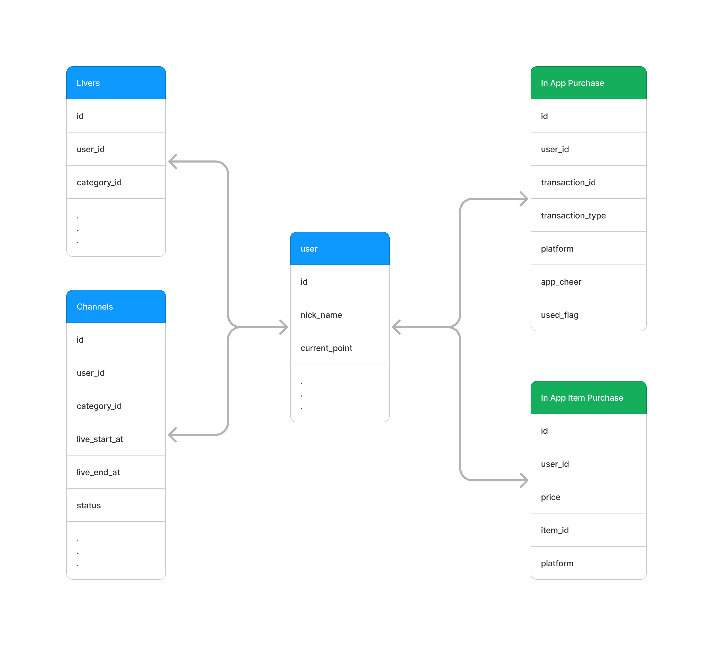

# Databases

This application utilizes two hosting database platforms:

Certainly! Here's the updated AWS Database section with the additional information:

---

## AWS Database

The MySQL database is hosted on AWS and is primarily used for managing web content. The database includes the following tables:

- **in_app_purchases**: Stores information related to in-app purchases.
- **in_app_item_purchases**: Tracks individual item purchases within the application.

Only these two tables are created specifically for the application. Additionally, data from the following tables are utilized for various features:

- **Users**
- **Livers**
- **Channels**

For further details, please refer to the web content documentation.

### Modules

### Tables

## Firebase Database

Firebase provides the second hosting service for this application, offering a NoSQL database. It comprises five collections:

- **Levels**: Stores data related to levels.
- **Msgs**: Stores messaging within the application.
- **Notification**: Stores notification data.
- **Reports**: Contains analytics and reporting data.
- **Users**: Stores user profiles and related information.

### Modules

### Tables (Collections)

